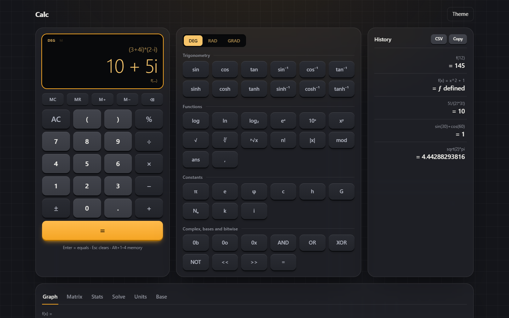
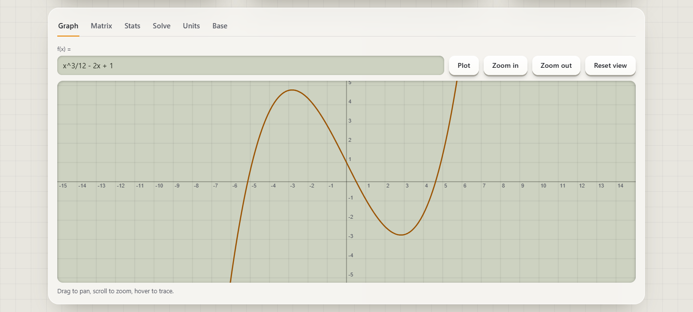
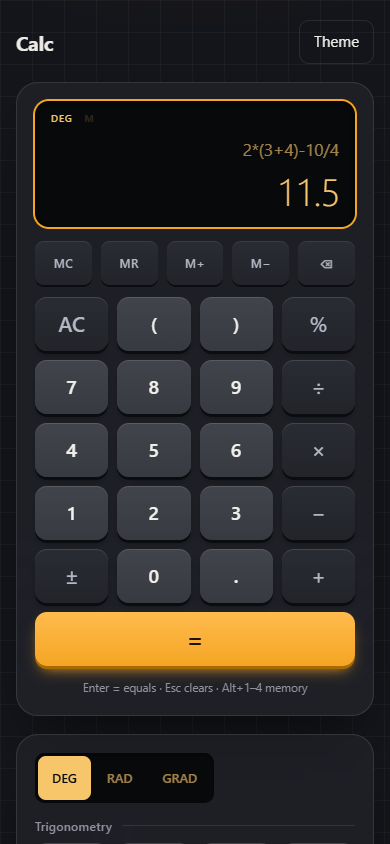

# Calc — Scientific Calculator for the Browser

**A fast, offline-capable scientific and graphing calculator that runs in any modern browser. No install, no account, no build step.**

[](LICENSE)


### ▶ [Try the live demo](https://develifture.github.io/scientific-calculator/)



## What is it?

Calc is a scientific calculator, graphing tool and small math workbench in one web page. You type an expression the way you would write it (`2π`, `3(4+1)`, `sin(30)`, `f(x) = x^2 + 1`) and see the result as you type. It is built on [math.js](https://mathjs.org/) and plain HTML, CSS and JavaScript. Every feature is free.

## Who is it for?

- **Students** (high school and university) who need trig, logs, complex numbers, matrices, statistics and function plots without buying a graphing calculator or installing software.
- **Engineers, developers and scientists** who want quick unit conversion, physical constants, bitwise operations and BIN/OCT/DEC/HEX conversion in a browser tab.
- **Teachers** who want to project a clean, readable calculator and graph in class.
- **Front-end developers** who want a readable reference project: a real app in under 1,000 lines of framework-free code, with tests, keyboard and screen-reader support, and a strict Content Security Policy.

## Why use it?

- **Free, no strings.** No account, no ads, no paid tier.
- **Nothing to install.** Open the link on a phone, tablet or desktop.
- **Private and offline.** No backend, no tracking, no third-party scripts. math.js ships in the repo, so the page works without internet once it is loaded.
- **Natural input.** Implicit multiplication, live preview, full keyboard control, history you can click to reuse.
- **More than a calculator.** Graphing, matrices, statistics, regression, equation solving and unit conversion in the same page.

## Features

- **Everyday math:** arithmetic, `%`, `±`, parentheses, live result preview, implicit multiplication (`2π`, `3(4+1)`)
- **Scientific:** trig, inverse and hyperbolic functions with DEG / RAD / GRAD; `log`, `ln`, `log₂`, powers, roots, `n!`, `|x|`, `mod`
- **Constants and complex numbers:** π, e, φ, c, h, G, Nₐ, k and `i`
- **Graphing:** plot `f(x)` with zoom, pan and trace
- **Matrices:** add, multiply, determinant, inverse, transpose
- **Statistics:** mean, median, variance, standard deviation, linear regression
- **Solver:** polynomial roots and systems of linear equations
- **Conversion:** units (length, mass, temperature, time, data) and BIN / OCT / DEC / HEX with bitwise operators
- **Variables and functions:** `a = 4`, `f(x) = x^2 + 1`
- **Memory and history:** MC, MR, M+, M−; unlimited history, click to reuse, export as CSV or copy
- **Light and dark theme**, keyboard control, responsive layout for phone, tablet and desktop



<p align="center"></p>

## Keyboard

| Key | Action |
| --- | --- |
| `Enter` | Evaluate |
| `Esc` | Clear |
| `Alt+1` … `Alt+4` | MC, MR, M+, M− |
| Any character | Focuses the expression field |

## Run locally

Requires Node.js 18 or newer (only for the dev server and tests; the app itself is static files).

```sh
git clone https://github.com/Develifture/scientific-calculator.git
cd scientific-calculator
npm install
npm start    # serves src/ at http://localhost:5173
npm test     # node --test
```

You can also host the `src/` folder on any static web server. The live demo is served by GitHub Pages from the `gh-pages` branch, which holds a copy of `src/`.

## Project structure

```
src/
  index.html   page shell, strict CSP
  app.js       keypad, keyboard, history, memory, theme
  engine.js    math.js wrapper: parsing, angle modes, formatting, scope
  panels.js    tool tabs (graph, matrix, stats, solve, units, base)
  tools.js     pure math helpers for the panels
  graph.js     canvas plotter with zoom, pan and trace
  vendor/      bundled math.js (Apache-2.0)
tests/         node:test suite for the engine
```

math.js is vendored in `src/vendor/math.js` (copied from `node_modules/mathjs/lib/browser/math.js`), so the page loads no third-party scripts. After upgrading mathjs, copy the bundle again.

## Contributing

Issues and pull requests are welcome. Run `npm test` before you open a pull request.

## License

[MIT](LICENSE). The vendored math.js bundle in `src/vendor/` is Apache-2.0; its notices are in `src/vendor/math.js.LICENSE.txt`.
