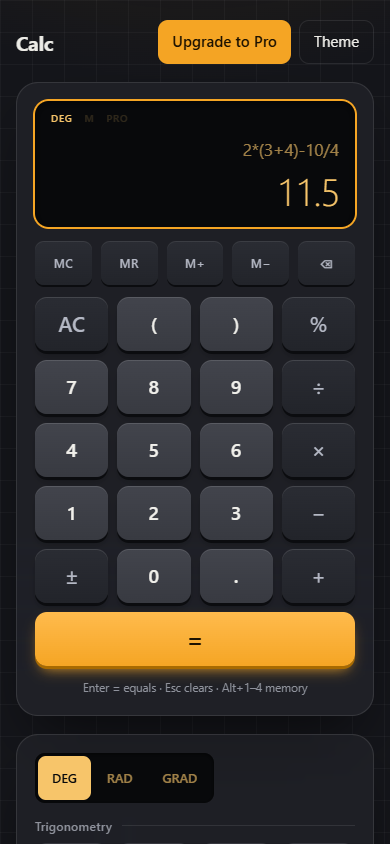

# Calc — Scientific Calculator for the Browser

**A fast, offline-capable scientific and graphing calculator that runs in any modern browser. No install, no account, no build step.**

[](https://github.com/Develifture/scientific-calculator/actions/workflows/ci.yml)
[](LICENSE)


### ▶ [Try the live demo](https://develifture.github.io/scientific-calculator/)


## What is it?

Calc is a scientific calculator, graphing tool and small math workbench in one web page. You type an expression the way you would write it (`2π`, `3(4+1)`, `sin(30)`, `f(x) = x^2 + 1`) and see the result as you type. It is built on [math.js](https://mathjs.org/) and plain HTML, CSS and JavaScript.

It also includes a **demo "Pro" tier** with a fake paywall. It shows how to split free and paid features in a front-end app, with all paywall logic in one small module that can later be replaced by a real payment provider. Nothing is ever charged.

## Who is it for?

- **Students** (high school and university) who need trig, logs, complex numbers, matrices, statistics and function plots without buying a graphing calculator or installing software.
- **Engineers, developers and scientists** who want quick unit conversion, physical constants, bitwise operations and BIN/OCT/DEC/HEX conversion in a browser tab.
- **Teachers** who want to project a clean, readable calculator and graph in class.
- **Front-end developers** who want a readable reference project: a real app in about 1,000 lines of framework-free JavaScript, with tests, keyboard and screen-reader support, a strict Content Security Policy, and a freemium paywall pattern.

## Why use it?

- **Nothing to install.** Open the link on a phone, tablet or desktop.
- **Private and offline.** No backend, no tracking, no third-party scripts. math.js ships in the repo, so the page works without internet once it is loaded.
- **Natural input.** Implicit multiplication, live preview, full keyboard control, history you can click to reuse.
- **More than a calculator.** Graphing, matrices, statistics, regression, equation solving and unit conversion in the same page.

## Features

| Free | Pro (demo unlock, no payment) |
| --- | --- |
| Arithmetic, `%`, `±`, parentheses | Trig, inverse and hyperbolic functions, DEG / RAD / GRAD |
| Live result preview, implicit multiplication | `log`, `ln`, `log₂`, powers, roots, `n!`, `mod` |
| Memory: MC, MR, M+, M− | Constants: π, e, φ, c, h, G, Nₐ, k; complex numbers |
| History of the last 20 results | Function graphing with zoom, pan and trace |
| Keyboard support | Matrices: add, multiply, determinant, inverse, transpose |
| Light and dark theme | Statistics and linear regression |
| | Polynomial roots and linear systems |
| | Unit conversion; BIN/OCT/DEC/HEX and bitwise ops |
| | Variables and user functions (`a = 4`, `f(x) = x^2 + 1`) |
| | Unlimited history with CSV export |


<p align="center"></p>

## Keyboard

| Key | Action |
| --- | --- |
| `Enter` | Evaluate |
| `Esc` | Clear |
| `Alt+1` … `Alt+4` | MC, MR, M+, M− |
| Any character | Focuses the expression field |

## Run locally

Requires Node.js 18 or newer (only for the dev server and tests; the app itself is static files).

```sh
git clone https://github.com/Develifture/scientific-calculator.git
cd scientific-calculator
npm install
npm start    # serves src/ at http://localhost:5173
npm test     # node --test, 24 tests
```

You can also host the `src/` folder on any static web server. Every push to `main` runs the tests and deploys `src/` to GitHub Pages.

## Project structure

```
src/
  index.html   page shell, strict CSP
  app.js       keypad, keyboard, history, memory, theme
  engine.js    math.js wrapper: parsing, angle modes, formatting, scope
  panels.js    Pro tool tabs (graph, matrix, stats, solve, units, base)
  tools.js     pure math helpers for the panels
  graph.js     canvas plotter with zoom, pan and trace
  paywall.js   the fake paywall: isPro(), unlock(), reset()
  vendor/      bundled math.js (Apache-2.0)
tests/         node:test suites for engine and paywall
```

math.js is vendored in `src/vendor/math.js` (copied from `node_modules/mathjs/lib/browser/math.js`), so the page loads no third-party scripts. After upgrading mathjs, copy the bundle again.

## About the Pro paywall

The Pro tier is a **client-side demo only**. "Unlock Pro" waits briefly and then sets a flag in `localStorage`. Nothing is charged, no payment details are collected, and anyone can bypass the flag. "Reset to Free" turns it off again.

All paywall logic lives in `src/paywall.js`. To make it real, replace that module with a real checkout (for example Stripe Checkout) and check entitlement on a server.

## Contributing

Issues and pull requests are welcome. Run `npm test` before you open a pull request.

## License

[MIT](LICENSE). The vendored math.js bundle in `src/vendor/` is Apache-2.0; its notices are in `src/vendor/math.js.LICENSE.txt`.
